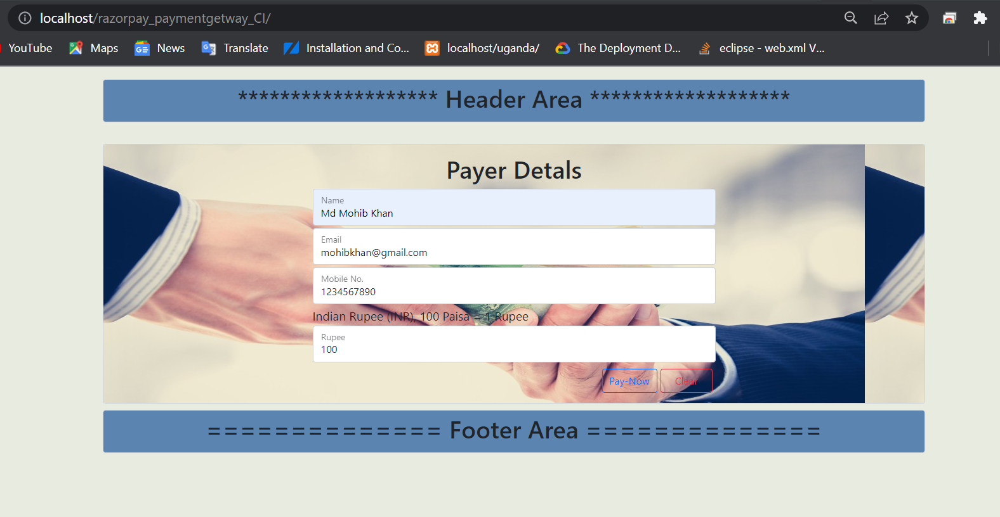
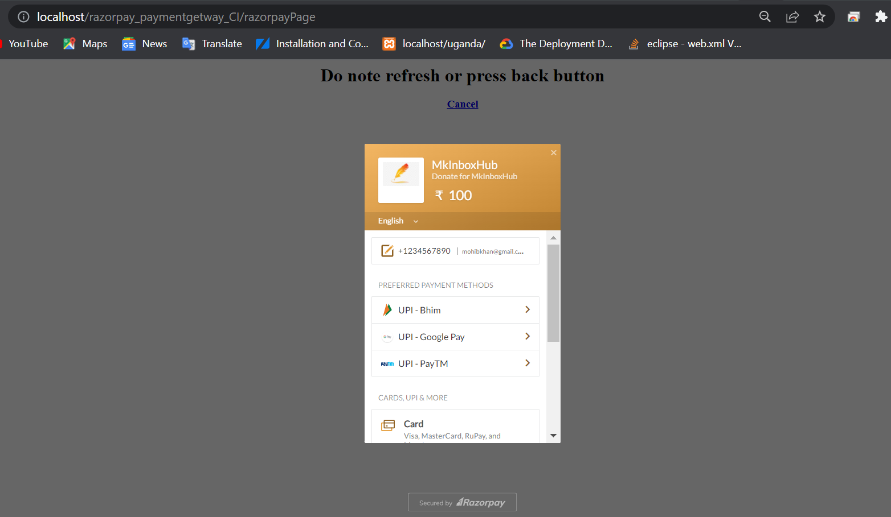
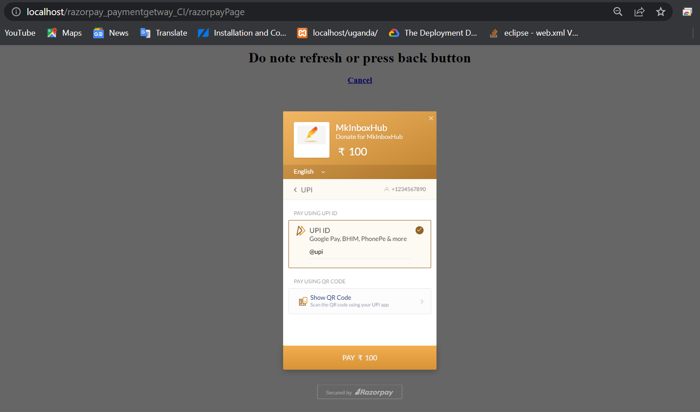
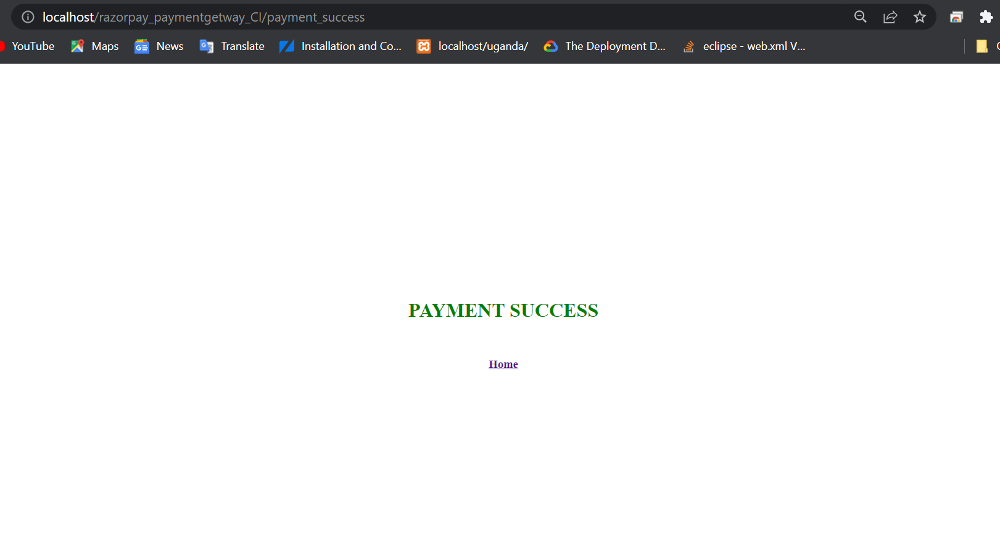

# Razorpay Paymentgetway in Codeigniter
This Repository will help to add paymentgetway by the help of Razorpay.
1)  Download Razorpay PHP kit from github(Link : https://github.com/razorpay/razorpay-php/releases).
2)  Extract downloaded Razorpay kit.
3)  Download codeigniter from https://codeigniter.com/download.
4)  Extract and Configure your codeigniter project.
5)  Copy the extracted razorpay-kit and past it in codeigniterProject/Application/views folder.
6)  Create view file to collect some information of Customer(like: Name, Email, Mobile No, Amount, etc.). 
7)  Create a controller to render this page .
8)  Now, goto razorpay official website(https://razorpay.com/) and create razorpay account and generate 'keyId' and 'secretKey'.
9)  Create a function which collect customer infomation from view page and then load razorpay/Razorpay.php file from view.
10)  Like : 

	$dataForRazorpay=Array();
            $dataForRazorpay["CustomerDetails"]=Array(
	    	"CustomerName"=>$this->input->post('name'),
		"CustomerEmail"=>$this->input->post('email'),
		"CustomerMobile"=>$this->input->post('mobile'),
		"PayAmount"=>$this->input->post('amount')
		);
            
            $dataForRazorpay["razorpay_Credentials"]=Array(
	    	"keyId"=>"rzp_test_Qcjdhfehfejhu",
		"secretKey"=>"bAnjedehhehdhedj"
            );
            
            $this->load->view("razorpay/Razorpay",$dataForRazorpay);
12)  Write some code in Razorpay file as I written. Then create two view file inside views/razorpay directory and write code as I written.

